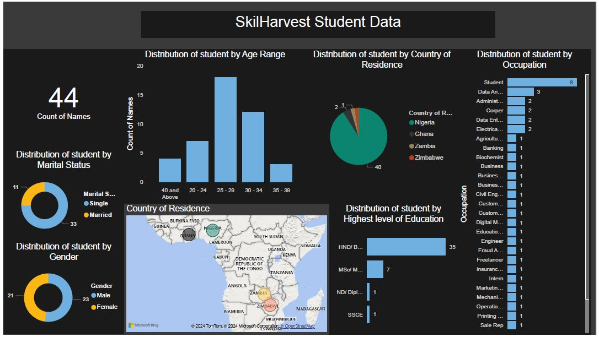

# SkilHarvest-Class-Assignment-2
- SkilHarvest Second Assignment practice and documentation

---

## Project Overview

This Data analysis project seeks to generate insight into Skilharvest student information to know the distribution of student according to age,gender,Marital status,level of education,country of residence and Occupation. The analysis would allow us draw data driven conclusion based on the outcome of the analysis as well as to advice on how to create more inclusive learning as regards all groups captured in this project.

---
## Project Outline
- SkilHarvest-Class-Assignment-2 [SkilHarvest-Class-Assignment-2](#skilharvest-class-assignment-2)
- Project Overview [Project Overview](#project-overview)
- Data Source [Data Source ](#data-source )
- Tools Used [Tools Used](#tools-used)
- Data Analysis [Data Analysis](#data-analysis)
  

---
## Data Source 
The primary source of the data used in this Analysis is from skilhavest practical class seassion it was collected using google form  [ClICK HERE TO DOWNLOAD](https://tinyurl.com/2nwp7yjp) 

---
## Tools Used 
The tools used for this analysis are listed below  
- PowerBI
- power query
- Google sheet [click Here](https://tinyurl.com/2nwp7yjp)
---
## Data Analysis

The primary data was collected during one of the practical classes using google form then the data was cleaned empty cells were filled with the correct inpute aswell as phone numbers with dailing codes were replaced to remove dailing codes also Some of the uncapitalized first letter for inpute like student were corrected, some other basic operation were carried out on the cleaned data this operations includes the addition of conditional colums to the Months columns to help with the sorting of the months in chronological order. 

